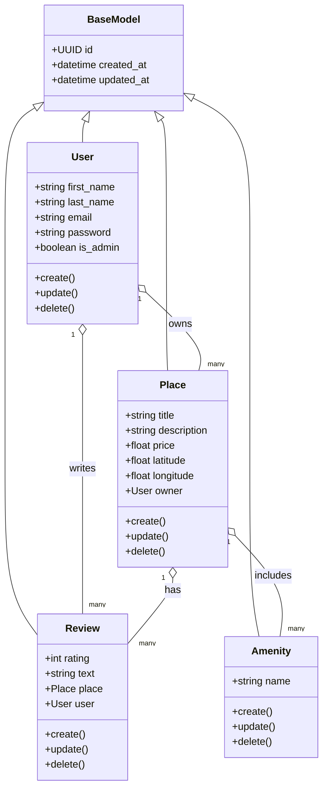
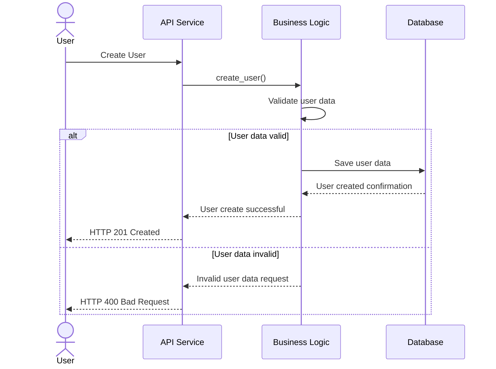
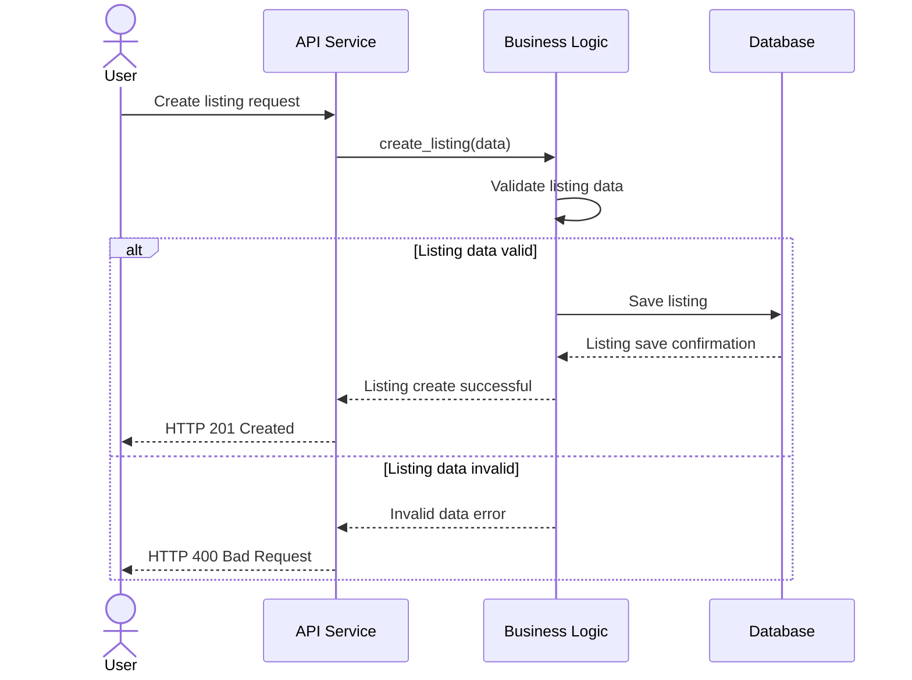
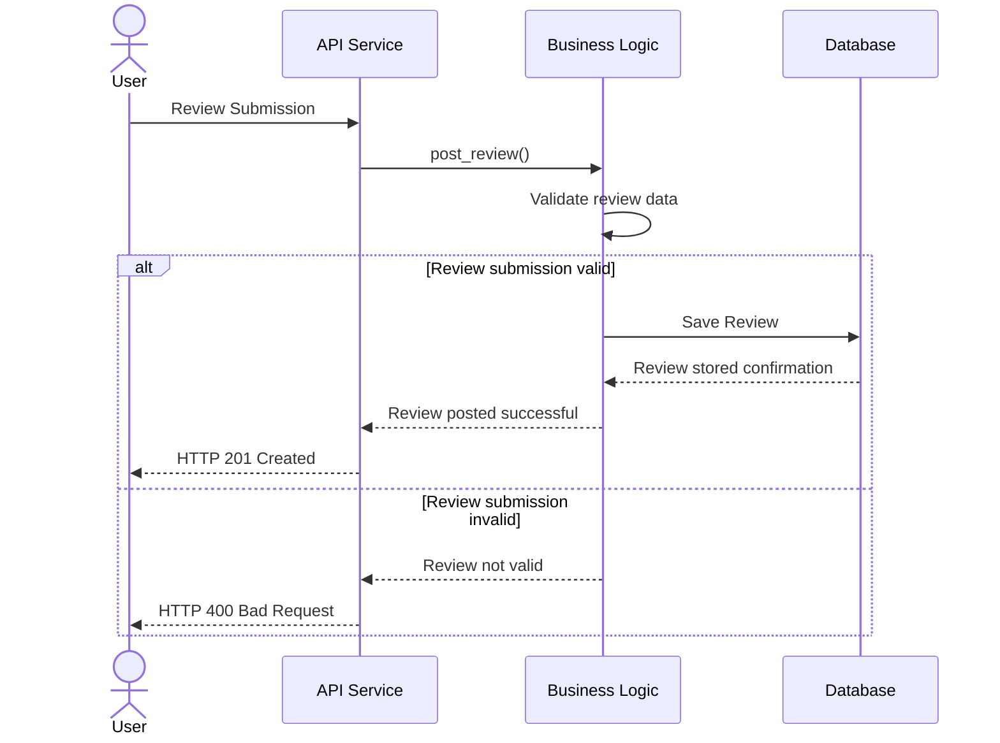
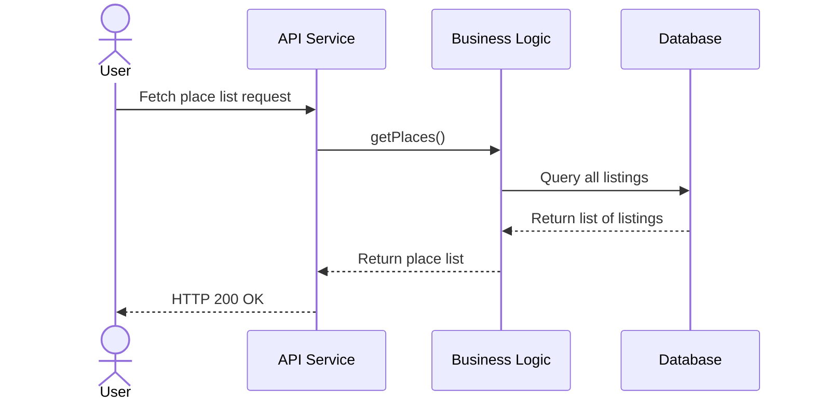

# 🏠 HBnB Evolution – Technical Design Document (Enhanced Version)

## Table of Contents
1. [Introduction](#1-introduction)  
2. [High-Level Architecture](#2-high-level-architecture)  
   - 2.1 Architectural Overview  
   - 2.2 High-Level Package Diagram  
3. [Business Logic Layer – Class Diagram](#3-business-logic-layer--class-diagram)  
   - 3.1 Overview  
   - 3.2 Class Diagram  
   - 3.3 Design Rationale and Class Notes  
4. [API Interaction Flow – Sequence Diagrams](#4-api-interaction-flow--sequence-diagrams)  
   - 4.1 User Registration  
   - 4.2 Place Creation  
   - 4.3 Review Submission  
   - 4.4 Fetching List of Places  
5. [Conclusion](#5-conclusion)

---

## 1. Introduction

### 1.1 Purpose of This Document 📄
This document provides a **comprehensive architectural and design blueprint** for the HBnB Evolution application, a simplified AirBnB-like platform. It serves as a reference for developers, testers, and stakeholders during the implementation phases.

### 1.2 Scope 🎯
This document includes:  
- 🏗️ High-Level Architecture with **layer explanations and Facade Pattern rationale**  
- 📊 Detailed Class Diagram for the Business Logic layer with **per-class notes**  
- 🔄 Sequence Diagrams for key API interactions with **step-by-step explanations**  

---

## 2. High-Level Architecture

### 2.1 Architectural Overview 🏛️
HBnB Evolution is based on a **three-layer architecture**:

**Presentation Layer 🌐**  
- Exposes RESTful APIs  
- Handles HTTP requests/responses  
- Acts as **facade to Business Logic Layer**  

**Business Logic Layer ⚙️**  
- Core domain entities and business rules  
- Validates inputs and enforces constraints  

**Persistence Layer 💾**  
- Abstracts database operations  
- Stores and retrieves data efficiently  

**Rationale for Layering:**  
- Separation of concerns  
- Easier testing and maintenance  
- Flexibility for future extensions  

**Facade Pattern:**  
- `HBNBFacade` acts as a single interface to the Business Logic  
- Reduces complexity for the Presentation Layer  
- Encapsulates multiple operations (CRUD, validation) in one point of access  

---

### 2.2 High-Level Package Diagram 🗂️

```mermaid
classDiagram
    %% =======================
    %% Presentation Layer
    %% =======================
    class API {
        <<Presentation>>
        %% Handles user requests via endpoints
    }
    class Services {
        <<Presentation>>
        %% Provides service logic for API
    }

    %% =======================
    %% Business Logic Layer
    %% =======================
    class BusinessLogicLayer {
        <<Facade>>
        %% Unified interface to interact with models
    }

    %% =======================
    %% Persistence Layer
    %% =======================
    class Repository {
        <<Persistence>>
        %% Manages data operations for models
    }
    class Database {
        <<Persistence>>
        %% Stores application data
    }

    %% =======================
    %% Models
    %% =======================
    class User {
        <<Model>>
    }
    class Place {
        <<Model>>
    }
    class Review {
        <<Model>>
    }
    class Amenity {
        <<Model>>
    }

    %% =======================
    %% Relationships
    %% =======================
    API --> Models : Uses Facade
    Services --> Models : Uses Facade
    HBNBFacade --> Repository : Interacts With
    Repository --> Database : Stores Data

    %% Models connected to Repository
    Repository --> User : Manages
    Repository --> Place : Manages
    Repository --> Review : Manages
    Repository --> Amenity : Manages

```mermaid
classDiagram
    %% =======================
    %% Presentation Layer
    %% =======================
    class API {
        <<Presentation>>
        %% Handles user requests via endpoints
    }
    class Services {
        <<Presentation>>
        %% Provides service logic for API
    }

    %% =======================
    %% Business Logic Layer
    %% =======================
    class HBNBFacade {
        <<Facade>>
        %% Unified interface to interact with models
    }

    %% =======================
    %% Persistence Layer
    %% =======================
    class Repository {
        <<Persistence>>
        %% Manages data operations
    }
    class Database {
        <<Persistence>>
        %% Stores application data
    }

    %% =======================
    %% Models
    %% =======================
    class User {
        <<Model>>
    }
    class Place {
        <<Model>>
    }
    class Review {
        <<Model>>
    }
    class Amenity {
        <<Model>>
    }

    %% =======================
    %% Relationships
    %% =======================
    API --> HBNBFacade : Uses Facade
    Services --> HBNBFacade : Uses Facade
    HBNBFacade --> Repository : Interacts With
    Repository --> Database : Stores Data

```

**Notes 💡**  
- The **Presentation Layer** communicates only through the Facade.  
- The **Business Logic Layer** coordinates operations and delegates persistence tasks.  
- The **Persistence Layer** is independent of the Presentation Layer.  

---

## 3. Business Logic Layer – Class Diagram

### 3.1 Overview 🔹
Core entities:  
- 👤 **User** – represents platform users  
- 🏡 **Place** – represents property listings  
- ✍️ **Review** – user feedback  
- 🛏️ **Amenity** – features associated with a place  

**Key Features:**  
- UUID identifiers, timestamps  
- CRUD methods for API support  
- Relationships define ownership and aggregation  

---

### 3.2 Class Diagram 📊


---

### 3.3 Design Rationale and Class Notes 💡

| Class  | Purpose | Notes |
|--------|---------|-------|
| BaseModel | Base for all entities | Provides `id`, `created_at`, `updated_at` |
| User | Platform user | Supports authentication; owns listings & reviews |
| Place | Property listing | Linked to User and Amenities; contains CRUD methods |
| Review | Feedback on Place | Connected to User and Place; rating & comment fields |
| Amenity | Features of Place | Many-to-many relationship with Place; flexible for future features |

**Relationships:**  
- **User → Place:** ownership of listings  
- **User → Review:** submission of reviews  
- **Place → Review:** multiple reviews per listing  
- **Place → Amenity:** allows multiple amenities per property  

---

## 4. API Interaction Flow – Sequence Diagrams

### 4.1 User Registration 📝


**Notes:**  
- Validation ensures email format, password strength  
- Database only receives validated data  

---

### 4.2 Place Creation 🏡


**Notes:**  
- Validates listing data before saving  
- Ensures correct ownership by User  

---

### 4.3 Review Submission ✍️


**Notes:**  
- Allows users to submit feedback only for valid places  
- Validation of rating and comment required  

---

### 4.4 Fetching a List of Places 📋


**Notes:**  
- Supports optional filters for price, location, amenities  
- Returns structured JSON to the client  

---

## 5. Conclusion ✅
This document provides a **complete technical blueprint** for HBnB Evolution:  

- 🧹 Separation of concerns with layered architecture  
- 🛠️ Maintainable, extensible codebase  
- 🌟 Clear understanding of core entities, relationships, and API flows  
- ✅ Ready reference for developers and testers  
