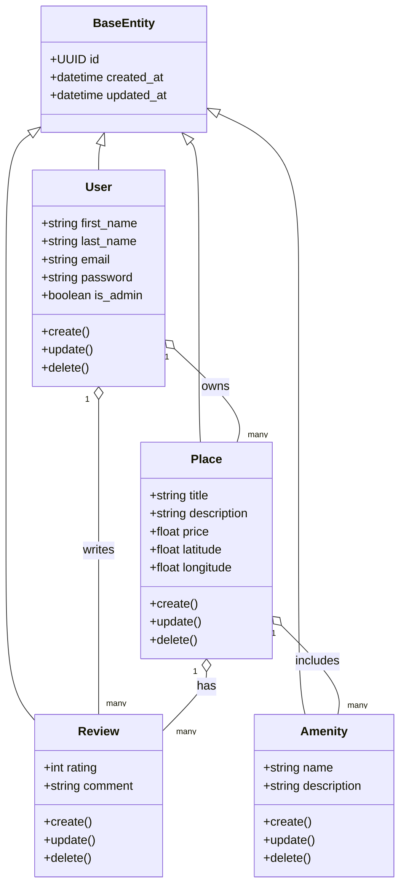

# HBnB Evolution - Business Logic Layer Class Diagram

This diagram illustrates the core entities in the Business Logic layer, their attributes, methods, and relationships.

##  Business Logic Entity Explanatory Notes

### BaseEntity
**Role:** Base entity shared by all other entities.  
**Key Attributes:** `id`, `created_at`, `updated_at`  
**Methods:** None (inherited)  

### User
**Role:** Represents system users (regular or admin).  
**Attributes:** `first_name`, `last_name`, `email`, `password`, `is_admin`  
**Methods:** `create()`, `update()`, `delete()`  
**Relationships:** Owns multiple `Place` objects; writes multiple `Review` objects.  

### Place
**Role:** Represents properties/listings.  
**Attributes:** `title`, `description`, `price`, `latitude`, `longitude`  
**Methods:** `create()`, `update()`, `delete()`  
**Relationships:** Owned by a `User`; has multiple `Review` objects; includes multiple `Amenity` objects.  

### Review
**Role:** Represents user reviews for places.  
**Attributes:** `rating`, `comment`  
**Methods:** `create()`, `update()`, `delete()`  
**Relationships:** Linked to a `User` and a `Place`.  

### Amenity
**Role:** Represents facilities or services associated with places.  
**Attributes:** `name`, `description`  
**Methods:** `create()`, `update()`, `delete()`  
**Relationships:** Associated with multiple `Place` objects (many-to-many)

